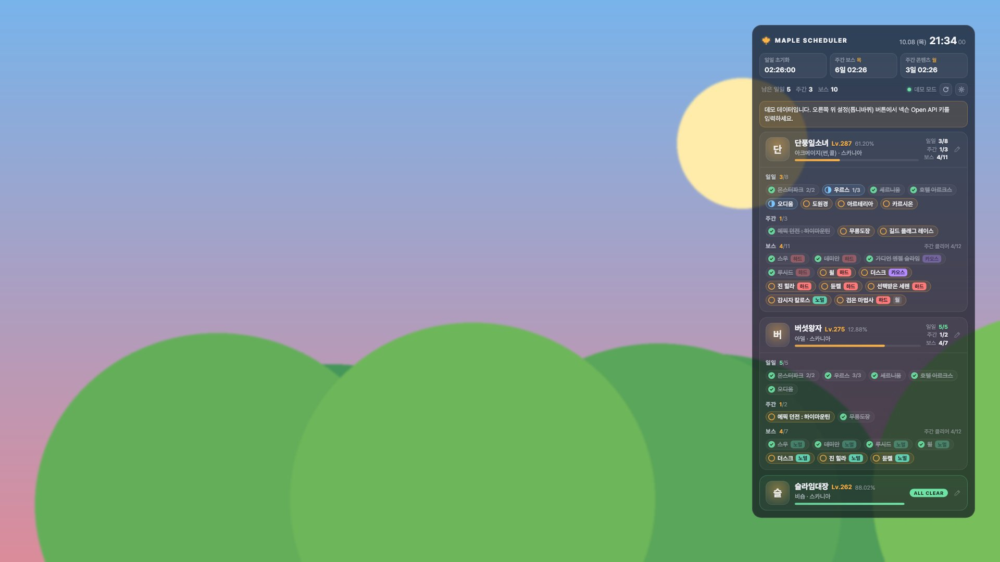
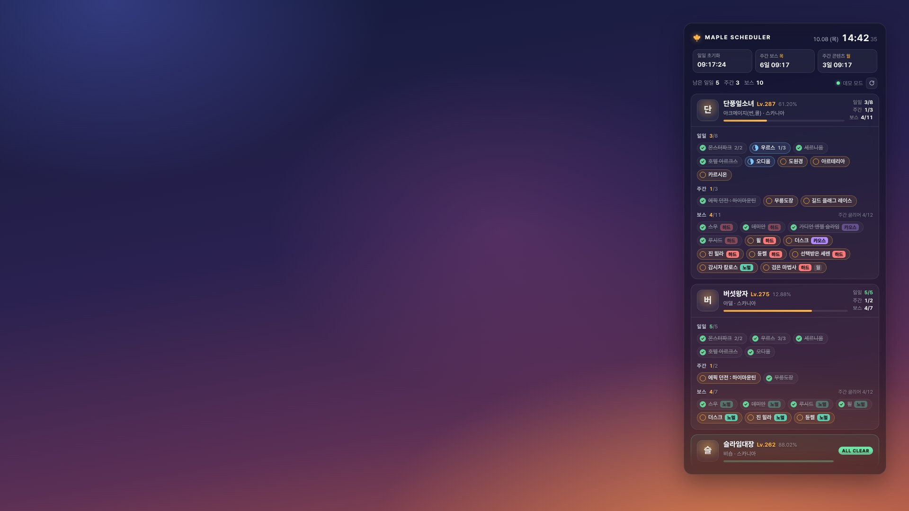
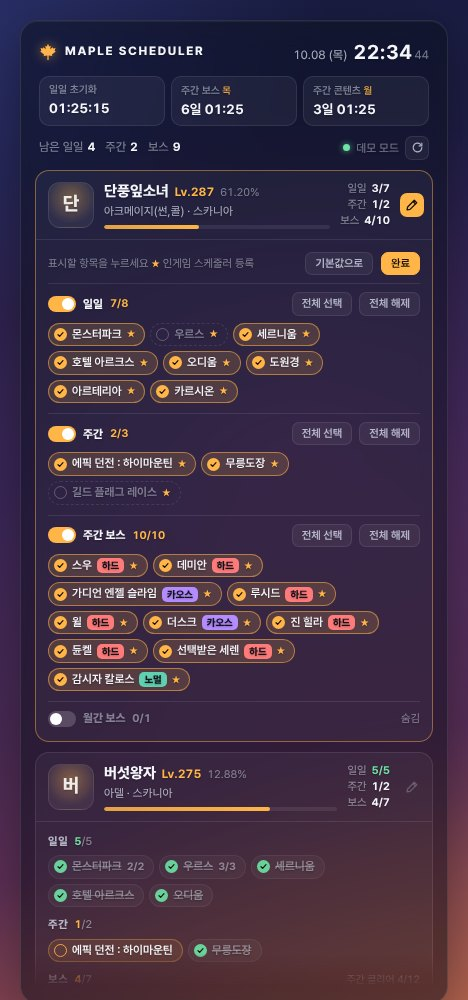

# Maple Scheduler HUD

넥슨 Open API로 메이플스토리 캐릭터들의 **인게임 스케줄러**(일일 · 주간 · 보스) 진행 상황을 받아와
Wallpaper Engine 배경화면 위에 반투명 HUD로 띄워줍니다.



- 계정의 캐릭터 중 인게임 스케줄러에 항목을 등록해 둔 캐릭터를 자동으로 찾습니다. 이름을 직접 지정할 수도 있습니다.
- 캐릭터마다 일일 콘텐츠 · 주간 콘텐츠 · 보스의 완료 여부와 횟수, 주간 보스 클리어 횟수를 보여줍니다.
- 일일(00:00), 주간 보스(목 00:00), 주간 콘텐츠(월 00:00) 초기화까지 남은 시간을 KST 기준으로 보여줍니다.
- 자정이 지나면 API에 아직 반영되지 않았더라도 완료 표시를 미리 풀어둡니다.
- 위치 · 크기 · 투명도 · 강조색 · 열 개수를 바꿀 수 있습니다.

## 준비물

- **넥슨 Open API 키**: [openapi.nexon.com](https://openapi.nexon.com)에 넥슨 계정으로 로그인한 뒤 애플리케이션을 등록하고 메이플스토리 API 키를 발급받습니다.
  - 캐릭터 목록과 스케줄러는 **키를 발급한 넥슨 계정의 캐릭터** 기준으로 조회됩니다.

## 두 가지 사용 방법

|  | ① 오버레이 앱 (추천) | ② Wallpaper Engine 웹 배경화면 |
| --- | --- | --- |
| 지금 쓰는 배경화면 | **그대로 유지** (장면 · 동영상 · 웹 모두, 효과 포함) | HUD가 배경화면이 됨. 뒤에는 이미지 · 동영상만 깔 수 있음 |
| 설치 | 압축 풀고 exe 실행 | `myprojects`에 폴더 복사 |
| 설정 | 설정 창 (패널의 톱니바퀴 버튼 · 트레이 메뉴) | Wallpaper Engine 속성 패널 |
| 패널 뒤 흐림 효과 | 없음 | 있음 |
| CORS 문제 | 생기지 않음 | 환경에 따라 프록시가 필요할 수 있음 |

Wallpaper Engine은 배경화면 두 개를 겹쳐 띄울 수 없습니다. 그래서 ①은 HUD를 배경화면과 별개인
투명한 창으로 바탕화면 위에 띄웁니다. (Rainmeter 위젯과 같은 방식)

## ① 오버레이 앱

Windows 전용 네이티브 앱입니다. Windows 10/11에 기본으로 들어 있는 .NET Framework 4.8로 동작해서
따로 설치할 것이 없습니다. (64비트 Windows 10 1903 이상)

### 설치

1. 실행 파일을 받습니다.
   - **빌드된 파일 받기**: GitHub 저장소의 `Actions` 탭 → `CI` → 가장 최근 실행 → 아래쪽 `Artifacts`의
     `MapleSchedulerHUD`를 내려받아 압축을 풉니다. (GitHub 로그인 필요)
   - **직접 빌드**: [.NET 8 SDK](https://dotnet.microsoft.com/download)를 설치하고
     `dotnet build native/src/MapleHud -c Release`. 결과는 `native\src\MapleHud\bin\Release\net48\`에 생깁니다.
2. `MapleSchedulerHUD` 폴더를 원하는 곳에 두고 안의 `MapleSchedulerHUD.exe`를 실행합니다.
   - 같이 있는 dll 파일과 `fonts` 폴더가 필요하니 **폴더째** 두세요.
   - 서명되지 않은 프로그램이라 Windows SmartScreen 경고가 뜨면 `추가 정보 → 실행`을 누르세요.
3. 바탕화면 오른쪽 위에 HUD가 뜹니다. 패널 위쪽 **톱니바퀴** 버튼을 눌러 API 키를 입력하고 저장하세요.

> 예전 Electron 버전(`MapleSchedulerHUD-1.0.0-portable.exe`)을 쓰고 있었다면 종료하고 지워도 됩니다.
> 설정은 옮겨지지 않으니 API 키와 캐릭터별 표시 항목을 다시 정해 주세요.

### 사용법

- 작업 표시줄 알림 영역의 **단풍잎 아이콘**을 우클릭하면 메뉴가 나옵니다.
  - 지금 새로고침 · 설정 · 맨 앞으로 가져오기
  - 표시할 모니터 (모니터가 여러 개일 때)
  - 항상 다른 창 위에 표시
  - Windows 시작 시 자동 실행
  - 종료
- **HUD를 마우스로 끌어서 원하는 곳에 옮길 수 있습니다.** 다른 모니터로 옮겨도 됩니다.
  놓은 자리에서 가까운 모서리(왼쪽/오른쪽 × 위/아래)를 기준으로 거리를 저장해서, 카드를 접고 펼쳐 패널 높이가 바뀌어도
  화면 안쪽으로 늘어나고 해상도 · 배율이 바뀌어도 같은 자리에 붙어 있습니다. 예를 들어 화면 아래쪽 반에 두면 위로 늘어납니다.
  설정 창의 `가로/세로 위치`와 `여백`에도 그대로 반영됩니다.
- HUD 패널 밖을 클릭하면 아래에 있는 바탕화면 · 창으로 그대로 전달됩니다. 바탕화면 아이콘도 평소처럼 쓸 수 있습니다.
- HUD를 클릭해도 다른 창 위로 튀어나오지 않습니다. 다른 창을 열면 그 창이 HUD를 덮습니다.
  항상 보이게 하려면 트레이 메뉴의 `항상 다른 창 위에 표시`를 켜세요.
- 전체 화면 게임 중에는 HUD를 다시 그리지도, API를 부르지도 않습니다. 게임을 끄면 밀린 갱신을 합니다.
- `Win + D`(바탕화면 보기)를 누른 뒤 HUD가 안 보이면 트레이 아이콘을 클릭하세요.
- 설정 창에서 배치 · 크기 · 투명도 · 색을 바꾸면 저장하기 전에 HUD에 바로 보여 줍니다. 취소하면 되돌립니다.
  설정 창이 열려 있는 동안에는 HUD가 다른 창에 가려지지 않게 맨 위에 둡니다.
- API 키 · 캐릭터 이름은 `저장`을 누르면 바로 적용됩니다. HUD 위쪽에 `설정을 저장했습니다`와 진행 상황
  (`캐릭터 확인 중 1/3` → `스케줄러 받는 중 2/3`)이 뜨고, 다 받으면 `캐릭터 N명 반영`으로 바뀐 뒤 몇 초 후 사라집니다.
  창의 X로 닫을 때 바꾼 내용이 있으면 저장할지 묻습니다.
- 처음 불러올 때는 스케줄러를 먼저 모두 받아 카드를 채우고, 캐릭터 이미지는 그다음에 받습니다.
- 설정과 캐시는 `%APPDATA%\MapleSchedulerHUD\`(settings.json, store.json), 캐릭터 이미지는
  `%LOCALAPPDATA%\MapleSchedulerHUD\avatars\`에 저장됩니다. 문제가 생기면 같은 곳의 `error.log`를 확인하세요.

## ② Wallpaper Engine 웹 배경화면



### 설치

1. 이 저장소를 내려받습니다. (GitHub에서 `Code → Download ZIP`)
2. 압축을 푼 저장소에서 **`wallpaper` 폴더 하나만** `myprojects`에 복사하고 이름을 `maple-hud`로 바꿉니다.
   `myprojects` 안의 폴더 하나가 배경화면 하나라서, 저장소 전체(docs, proxy, test 등)를 넣으면 안 됩니다.
   ```
   ...\steamapps\common\wallpaper_engine\projects\myprojects\
   └─ maple-hud\          ← 저장소의 wallpaper 폴더
      ├─ project.json     ← 이 파일이 바로 여기 있어야 인식됩니다
      ├─ index.html
      ├─ preview.jpg
      ├─ css\
      └─ js\
   ```
   `proxy` 폴더는 CORS 문제가 생겼을 때만 쓰니 다른 곳에 따로 보관하세요.
3. Wallpaper Engine을 다시 열면 설치된 배경화면 목록에 **Maple Scheduler HUD**가 보입니다. 선택하세요.
4. 오른쪽 속성 패널에서 **[API] 넥슨 Open API 키**를 입력합니다. 키를 입력하기 전에는 데모 데이터가 보입니다.

### 설정 (배경화면 속성)

| 속성 | 설명 |
| --- | --- |
| [API] 넥슨 Open API 키 | 발급받은 키 |
| [API] 캐릭터 이름 | 쉼표로 구분해서 입력하면 그 캐릭터들만 그 순서대로 표시합니다. 비워두면 계정에서 자동으로 찾습니다. |
| [API] 자동 선택 최소 레벨 / 최대 캐릭터 수 | 자동으로 찾을 때 이 레벨 이상인 캐릭터만 살펴보고, 최대 이 수만큼 표시합니다. |
| [API] 갱신 주기 (분) | 스케줄러를 다시 받아오는 간격입니다. 넥슨 API의 게임 데이터 반영은 평균 15분쯤 걸려서 기본값도 15분입니다. |
| [API] 프록시 주소 | 보통 비워둡니다. 아래 [문제 해결](#문제-해결)을 참고하세요. |
| [표시] 등록 안 된 항목도 표시 | 끄면(기본) 인게임 스케줄러에 등록한 항목만 보입니다. |
| [표시] 완료한 항목 숨기기 / 모두 완료한 캐릭터 접기 | 남은 일정만 보고 싶을 때 켭니다. |
| [배치] 열 개수 · 카드 너비 · 크기 · 위치 · 여백 | 화면 어디에 어떤 크기로 띄울지 정합니다. 바탕화면 아이콘과 겹치지 않는 곳에 두세요. |
| [패널] 불투명도 · 흐림 · 강조 색상 | 반투명 패널의 모양을 정합니다. |
| [배경] 종류 · 이미지 · 동영상 · 맞춤 · 어둡게 | HUD 뒤에 깔릴 배경입니다. |

### 쓰던 배경화면의 이미지 · 동영상을 뒤에 깔기

이 방식에서는 HUD가 배경을 직접 그립니다. 쓰던 배경화면이 **동영상**이나 **이미지**라면
그 파일을 `[배경]` 속성에 지정하면 비슷하게 보입니다. 효과까지 그대로 쓰려면 ① 오버레이 앱을 쓰세요.

- 워크숍에서 받은 배경화면 파일은 `steamapps\workshop\content\431960\<배경화면 ID>\` 폴더에 있습니다.
  (Wallpaper Engine에서 배경화면을 우클릭하고 `탐색기에서 열기`를 누르면 바로 열립니다.)
- 동영상은 **webm**을 권장합니다. 웹 배경화면 엔진에서는 mp4(H.264)가 재생되지 않을 수 있습니다.
- 파일 선택 창에서 동영상이 안 보이면 `[배경] 파일 경로 또는 URL 직접 입력`에 전체 경로를 붙여넣으세요.
- 장면(Scene) 타입 배경화면은 웹 배경화면 안에 넣을 수 없습니다. ① 오버레이 앱을 쓰세요.

### 사용법

- 클릭이 안 되면 Wallpaper Engine 설정에서 배경화면 마우스 입력이 허용되어 있는지 확인하세요. 바탕화면 아이콘 위에서는 클릭이 배경화면으로 전달되지 않습니다.

## 공통 조작

- **카드 윗부분 클릭**: 캐릭터를 접거나 펼칩니다. 직접 접은 캐릭터는 계속 접혀 있습니다.
- **↻ 버튼**: 지금 바로 새로 받아옵니다. 30초에 한 번까지 누를 수 있습니다.
- **✎ 버튼** (카드 오른쪽 위, 마우스를 올리면 보임): 그 캐릭터에 표시할 항목을 고릅니다.

### 캐릭터별 표시 항목 고르기



✎ 버튼을 누르면 그 캐릭터의 스케줄러 항목이 **일일 · 주간 · 주간 보스 · 월간 보스**로 나뉘어 나옵니다.
키보드 없이 클릭만으로 되므로 Wallpaper Engine에서도 쓸 수 있습니다.

- **스위치**: 분류 전체를 보이거나 숨깁니다. 숨긴 분류는 나중에 새 항목이 생겨도 계속 숨겨집니다.
- **항목 클릭**: 하나씩 보이기/숨기기. `전체 선택` · `전체 해제`로 한 번에 바꿀 수도 있습니다.
- **★**: 인게임 스케줄러에 등록된 항목입니다. 아무것도 고르지 않은 캐릭터는 이 등록 항목만 보입니다.
- **기본값으로**: 고른 내용을 지우고 인게임 스케줄러 등록 기준으로 되돌립니다.
- 설정은 캐릭터마다 따로 저장되고, 배경화면이나 앱을 다시 켜도 유지됩니다.
  보스는 이름으로 기억하므로 난이도가 바뀌어도 선택이 유지됩니다.
- 위쪽 `남은 일정`과 카드의 진행률은 보이는 항목만 셉니다.

## 동작 방식

1. 표시할 캐릭터를 정합니다.
   - 이름을 지정했다면 `id` API로 캐릭터 식별자(ocid)를 찾습니다. 한 번 찾은 값은 30일 동안 저장해 둡니다.
   - 비워두었다면 `character/list`로 계정의 캐릭터 목록을 받아 레벨 순으로 스케줄러를 확인하고,
     인게임 스케줄러에 등록된 항목이 있는 캐릭터만 고릅니다. 등록된 캐릭터가 하나도 없으면 레벨 순으로 보여줍니다.
2. 캐릭터마다 `scheduler/character-state`로 스케줄러를, `character/basic`으로 캐릭터 이미지와 경험치를 받아옵니다.
   네이티브 앱은 스케줄러를 모든 캐릭터에 대해 먼저 받고, 이미지 · 경험치는 그다음에 받습니다.
3. 받은 데이터는 브라우저 저장소에 캐시합니다. 배경화면이 다시 켜지면 API를 부르지 않고 바로 보여주고, 인터넷이 끊겨도 마지막 데이터가 남아 있습니다.

| 데이터 | 다시 받는 간격 |
| --- | --- |
| 스케줄러 | 갱신 주기 (기본 15분), 자정 초기화 약 20분 뒤에 한 번 더 |
| 캐릭터 이미지 · 경험치 | 6시간 |
| 계정 캐릭터 목록 · 스케줄러 등록 여부 | 12시간 · 6시간 |

**API 호출량**: 하루에 대략 `캐릭터 수 × (1440 ÷ 갱신 주기)`번 호출합니다. 캐릭터 4명에 15분 주기면 약 400번입니다.
개발 단계 키는 하루 호출 한도가 있으니 캐릭터가 많으면 갱신 주기를 늘리세요.
웹 배경화면은 게임이 전체 화면이라 Wallpaper Engine이 배경화면을 멈추면 갱신도 멈춥니다.

## 성능 · 리소스

장시간 켜두는 용도라 메모리와 유휴 상태 부하를 측정했습니다.

| 항목 | ① 오버레이 앱 (네이티브) | ② 웹 배경화면 |
| --- | --- | --- |
| 메모리 | 개인 메모리 약 **32MB** (작업 집합 약 53MB, Windows CI에서 데모 화면 기준) — 예전 Electron 버전은 약 145MB | Wallpaper Engine 안에서 동작 |
| 프로세스 | 1개 | — |
| 매초 화면 갱신 | 시계·카운트다운만 다시 그림 (약 2ms). 카드 영역은 바뀔 때만 다시 그림 | 바뀐 글자만 고침 |
| 초 표시를 끄면 | 1분에 한 번만 그림 | 1분에 한 번만 그림 |
| 메모리 누수 | 15분 주기 동기화+다시 그리기를 650번(약 7일치) 반복해도 관리 메모리 약 1.3MB에서 늘지 않음 | 400번(약 4일치) 반복해도 늘지 않음 |

- 오버레이 앱은 전체 화면 게임 중에는 그리지도, API를 부르지도 않습니다. 웹 배경화면은 Wallpaper Engine이 배경화면을 멈추면 같이 멈춥니다.
- `시계·카운트다운 초 단위 표시`를 끄면 화면을 1분에 한 번만 다시 그립니다. 부하를 최소로 하고 싶을 때 끄세요.
- ② 웹 배경화면에서 **동영상 배경 + 패널 흐림**을 함께 쓰면 영상 프레임마다 흐림을 다시 계산합니다.
  저사양 PC라면 `[패널] 뒤 배경 흐림`을 0으로 두세요.
- 한 달 넘게 쓰지 않은 캐시(더 이상 표시하지 않는 캐릭터 등)는 시작할 때 자동으로 지웁니다.

## 문제 해결

- **API 키가 올바르지 않습니다**: 키를 앞뒤 공백 없이 다시 붙여넣으세요.
- **조회 권한이 없습니다**: 캐릭터 이름을 직접 넣었다면 API 키를 발급한 계정의 캐릭터인지 확인하세요.
- **캐릭터가 안 보입니다**: `자동 선택 최소 레벨`을 낮추거나 `캐릭터 이름`을 직접 넣어보세요.
- **① 앱을 실행하면 바로 꺼집니다**
  - 오류 창이 뜨면 그 내용과 `%LOCALAPPDATA%\MapleSchedulerHUD\error.log`를 확인하세요.
  - `필요한 파일이 없거나 이전 버전 파일과 섞였습니다`가 뜨면, 압축을 푼 뒤 실행했는지 확인하세요.
    업데이트할 때는 앱을 종료하고 `MapleSchedulerHUD` 폴더를 통째로 바꾸세요.
  - 아무 창도 없이 꺼진다면 이미 실행 중일 수 있습니다. 작업 표시줄 오른쪽 숨겨진 아이콘에서 단풍잎을 찾아보세요.
- **방금 한 콘텐츠가 완료로 안 바뀝니다**: 넥슨 API에 게임 데이터가 반영되기까지 평균 15분쯤 걸립니다.
- **네트워크 오류 (CORS 차단)**: ② 웹 배경화면에서 넥슨 API를 직접 부르지 못하는 환경입니다.
  ① 오버레이 앱으로 바꾸거나, 동봉한 로컬 프록시를 쓰세요.
  1. [Node.js](https://nodejs.org)를 설치합니다.
  2. 이 저장소 폴더에서 `node proxy/maple-hud-proxy.js`를 실행합니다. 창을 켜 둔 채로 둡니다.
  3. 배경화면 속성 `[API] 프록시 주소`에 `http://127.0.0.1:17890`을 입력합니다.
  - `NEXON_API_KEY` 환경변수로 키를 넘기면 배경화면 속성에는 키를 비워둬도 됩니다.

## 브라우저에서 미리 보기

`wallpaper/index.html`을 브라우저로 열면 그대로 동작합니다. 패널의 ⚙ 버튼으로 모든 설정을 바꿀 수 있고,
배경화면 속성과 같은 이름의 URL 파라미터로도 바꿀 수 있습니다.

```
index.html?demo=1&columns=2&alignx=left&aligny=bottom&uiscale=90&panelopacity=35&accentcolor=7cc7ff
```

## 개발

```
npm test                                         # 웹 배경화면: 초기화 시각, 스케줄러 해석, 설정 변환
dotnet test native/tests/MapleHud.Core.Tests     # 오버레이 앱: 로직, 동기화 엔진, 렌더링
dotnet build native/src/MapleHud -c Release      # 오버레이 앱 빌드 (리눅스에서도 됨)
```

렌더링 테스트에 `MAPLEHUD_PREVIEW_DIR` 환경변수를 주면 HUD 미리보기 PNG를 남깁니다.

| 파일 | 역할 |
| --- | --- |
| `native/src/MapleHud.Core/` | 오버레이 앱 핵심 (Windows 의존성 없음, .NET Standard 2.0) |
| ├ `KstTime.cs` · `Scheduler.cs` | KST 초기화 시각, 스케줄러 해석과 캐릭터별 표시 설정 |
| ├ `NexonApi.cs` · `SyncEngine.cs` | 넥슨 Open API 호출 (초당 호출 제한 준수), 캐릭터 결정·캐시·갱신 주기 |
| ├ `JsonStore.cs` · `HudSettings.cs` · `HudView.cs` | 캐시·설정 저장, 화면 상태와 사용자 조작 |
| └ `Render/HudRenderer.cs` | SkiaSharp로 HUD 그리기, 클릭 영역 |
| `native/src/MapleHud/` | Windows 앱 (.NET Framework 4.8, WinForms) |
| ├ `OverlayWindow.cs` · `Native.cs` | 반투명 레이어드 창, DPI, 마우스 |
| ├ `HudApp.cs` · `SettingsForm.cs` | 트레이, 1초 타이머, 설정 창 |
| └ `SelfTest.cs` | CI 자체 점검 (`--selftest out.png`) |
| `native/fonts/` | Pretendard 글꼴 (SIL OFL 1.1) |
| `wallpaper/` | Wallpaper Engine 웹 배경화면 (`project.json`, `js/`, `css/`) |
| `proxy/maple-hud-proxy.js` | (선택) 웹 배경화면용 CORS 우회 로컬 프록시 |
| `.github/workflows/ci.yml` | 테스트, Windows 빌드, 자체 점검, 배포 파일 |

> **주의**: API 키는 `project.json`에 직접 적지 마세요. 워크숍에 올리면 키가 그대로 공개됩니다.
> 속성 패널에 입력한 값은 내 PC의 Wallpaper Engine 설정에만 저장됩니다.

데이터 출처: NEXON Open API
